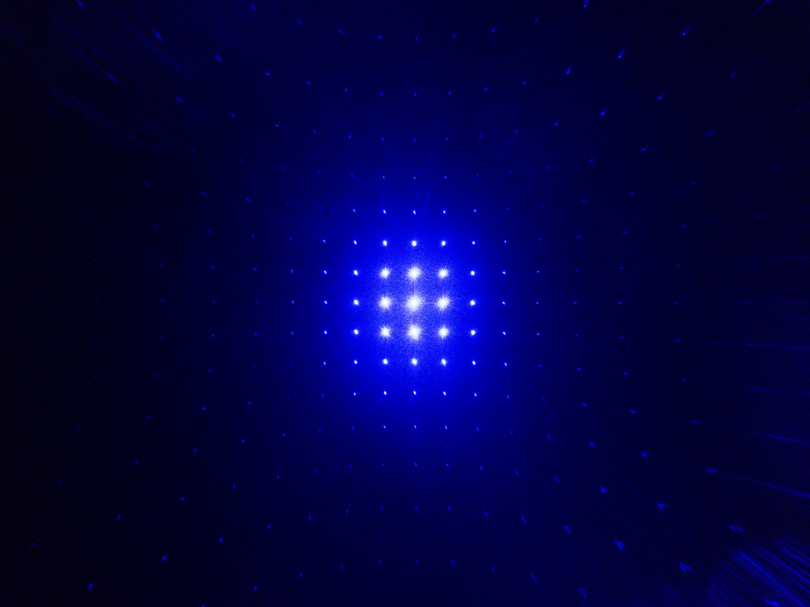
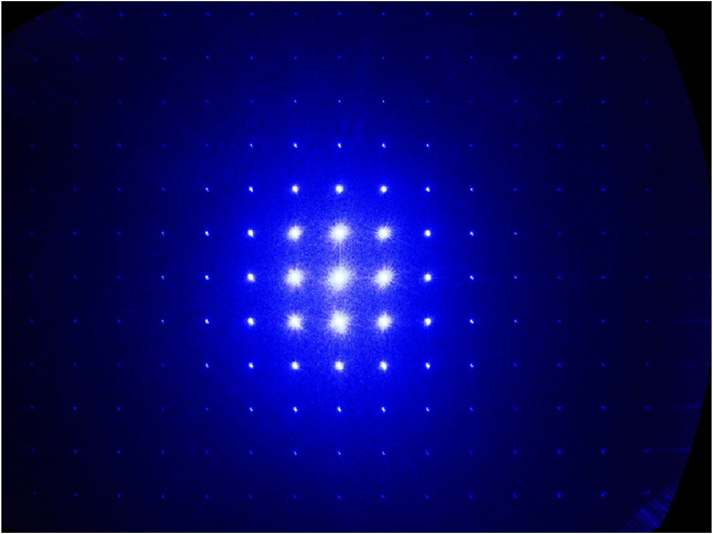

A library to compute diffraction patterns in 2D, and to undistort diffraction patterns in presence
of defects in diffraction gratings.

## Background
In the special case when the grating grooves/lines are perpendicular to the plane of incidence,
the diffraction grating equation is expressed as
$$\sin\theta_m + \sin\theta_i = m\frac{\lambda}{d}, \quad m=0, \pm 1, \pm 2, \ldots$$
where $m$ is the order of the diffracted wave, $\theta_i$ is the angle of incidence, 
$\lambda$ is the wavelength, and $d$ is the period of the grating. For this situation all of the 
diffracted orders lie in the plane of incidence. Harvey and Vernold provide an elegant
explanation of diffraction for the general case by introducing grating equations 
in the <em>direction cosine space</em>:
$$\alpha_m + \alpha_i = m\frac{\lambda}{d}, \quad \beta_m + \beta_i = 0,$$
where $(\alpha_i,\ \beta_i)$ are the direction cosines, so $\alpha_m = \sin\theta_m \cos\phi_0$, 
$\alpha_i = \sin\theta_0 \cos\phi_0$, and
$\beta_i = -\sin\phi_0$.
To emphasize, these equations apply to the general case, 
including the non-paraxial ("conical") diffraction grating case where the incident
beams are oblique.

Intuitive as these are, the equations still make use of trigonometrical functions, which 
introduce numerical instability, and furthermore are not conducive to vectorization.
This library avoids altogether the use of trigonometric functions in computing diffraction patterns.

## Assumptions and notations
In a lab we captured diffraction patterns induced by monochromatic lasers using the wide-angle
lens of an Android camera that had diffraction gratings affixed. The goals were to determine
the wavelength of the lasers, and undistort(rectilinearize) the captured images.

Assumptions:
1. The camera behaves like a perfect pin-hole camera (in particular images present no distortions apart from the diffraction distortion)
2. The camera's sensor is perfectly symmetric


In the figure above, red, green, and blue arrows represent the $x$-, $y$-, and $z$-axis respectively.
The $xy$ plane in this scheme represents the direction cosine space, which we denote as $Q$ space.
The camera's sensor, which floats above and is parallel to $Q$, is assumed to be distance $f$ away from $Q$, where $f$ is the 
focal length of the camera. We denote that plane as $R$.
Finally, the set of points on the unit hemisphere will be labeled as $S$.

The figure shows 9 points (red) $R_1, \ldots, R_9 \in R$, which are part of a diffraction pattern. 
The points $\{R_7,\ R_8,\ R_9,\ R_6,\ R_3 \}$ can be the $m$th order diffraction of a laser, in which case the set
$\{R_4,\ R_5,\ R_2\}$ can be considered the $(m-1)$ th order, 
and $\{R_1\}$ the $(m-2)$ th order diffraction.
These points are mapped to $S$ by dividing them by their 3D vector norms. Viz., $R_i \mapsto R_i/||R_i|| \in S$ (green dots).
The mapping $S\rightarrow Q$ in turn is a simple projection: $S_i = (x_i, y_i, z_i) \mapsto (x_i, y_i)$ (blue dots).

In theory, if $R_i, i=1,\ldots 9$ were from diffraction, their corresponding points $Q_i, i=1,\ldots 9$ must 
form a perfectly rectilinear grid in $Q$, with spacing $\lambda/d$, where $\lambda$ is the wavelength of the laser.
The mapping $Q\rightarrow R$ simply reverses these steps.

It is no coincidence that the math involved resembles that of
camera matrix computations using homogeneous coordinates.

## Imperfect gratings
In practice there are imperfections. The captured diffraction patterns exhibited characteristics that were 
results of rotation, shearing, and translation. My initial attempts in finding the right transformation
was sequential - for instance finding the rotation first and then the remaining transformations. It turned out 
that errors from each step accumulated. Thus in the end
the correct method was to find a single projective transformation that modeled all the deformations in $Q$ space at once.

Modules in this package can be used to undistort (convert) the first image below to the second.





For details of the procedure, see [application1 live script](matlab/notebooks/application2_correcting_for_imperfect_gratings.mlx).

To generate basic diffraction patterns, see [basic_usage.m](matlab/basic_usage.m).

## References
[Description of Diffraction Grating Behavior in Direction Cosine Space](https://doi.org/10.1364/ao.37.008158):

```
@article{Harvey1998,
  doi = {10.1364/ao.37.008158},
  url = {https://doi.org/10.1364/ao.37.008158},
  year = {1998},
  publisher = {Optica Publishing Group},
  volume = {37},
  number = {34},
  pages = {8158-8159},
  author = {James E Harvey and Cynthia L Vernold},
  title = {Description of Diffraction Grating Behavior in Direction Cosine Space},
  journal = {Applied Optics}
}
```
[Diffraction grating equation (wikipedia)](https://en.wikipedia.org/wiki/Diffraction_grating)

